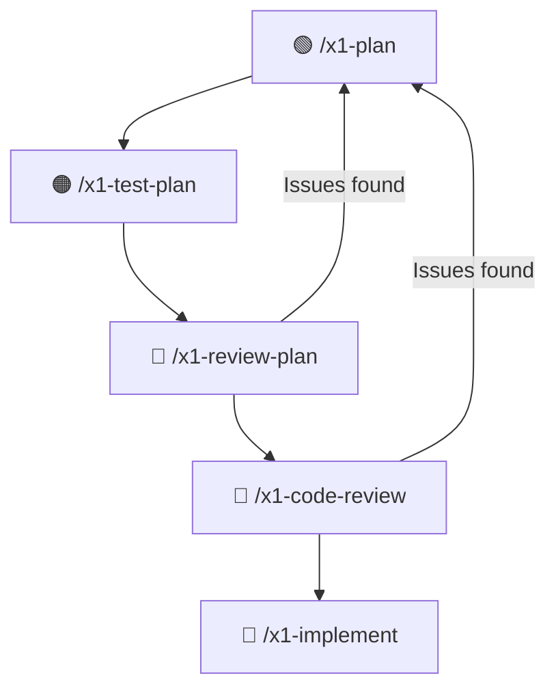

# X1 Method for Claude Code

One architect with [Claude Code](https://claude.com/claude-code) and the X1 Method can deliver in a week what used to take a small team 40-50 weeks. Not by vibe coding — by doing the opposite.

X1 is a set of Claude Code skills that turn AI-assisted development into a **force multiplier for architects**. You focus on what matters — understanding the problem, shaping the architecture, making design decisions — while AI handles the volume. The core idea: **make all the decisions at the plan level, where changes cost nothing, then let the AI execute mechanically against a plan that's already been stress-tested.**

The result is full traceability from user stories through acceptance criteria, architecture, implementation, and tests. Every test traces to an AC. Every AC traces to a user story. Every implementation item traces to both. Nothing gets lost. Nothing gets skipped.

## Why Not Just "Use AI to Code"?

Vibe coding — prompting an AI, glancing at the output, shipping it — works for toy projects. On a real codebase, it falls apart:

- **It skips understanding.** The AI jumps to code without understanding the problem. Did it solve the right thing? Did it consider edge cases in the requirements?
- **It duplicates instead of reusing.** It creates a new service when one already exists three files away. Now you have two ways to do the same thing and neither is complete.
- **It hallucinates APIs.** It calls `GetUser(id)` assuming it returns null on not-found. It actually throws. You find out in production.
- **It ignores failure.** What if the database is slow? What if two requests hit simultaneously? What if the input is empty, or 10MB, or contains SQL injection?

The code "works" on the happy path. Production is not the happy path.

X1 solves this by making the AI do the hard thinking *before* it writes code — and giving you control over every decision that matters.

## The Core Workflow

🟢 **Plan** — problem discovery, user stories, architecture, implementation checklist
🟠 **Test** — design tests that break things before code exists
🔴 **Review** — adversarial review of the plan, then its code snippets
🔵 **Implement** — mechanical TDD execution of what survived

> **Plan mode is required for steps 1–4.** Use `/plan` to enter plan mode before running `/x1-plan`. The entire planning, testing, and review workflow happens in plan mode — Claude researches, designs, and stress-tests without touching your code. Only `/x1-implement` (step 5) runs outside plan mode, where Claude executes against the approved plan.

### 1. Define the plan — `/x1-plan`

This is where most of the value lives. Instead of jumping to code, `/x1-plan` walks through a deliberate sequence that keeps you in the architect's seat:

**Start with the problem, not the solution.** What are you actually solving? Who's affected? What happens if you don't solve it? The skill pushes back on vague requirements and asks the questions you haven't thought of yet. It's a thinking partner, not a yes-machine.

**User stories focused on outcomes.** Not "as a user I want a feature." Acceptance criteria must describe testable end-to-end outcomes — not implementation details. If an AC names a specific class or field, it's wrong. This keeps the plan focused on *what* users need, not *how* the code works internally.

**Codebase investigation — only after requirements are locked.** The AI searches for existing implementations, understands your patterns, and reuses before creating. This is the single biggest waste eliminator. AI assistants love creating new things, and most of the time the thing already exists.

**Architecture with stress testing.** You shape the architecture. The AI stress-tests it with realistic scenarios before any code is written. What happens under concurrent load? What if a dependency is down? Where are the single points of failure? This is where you collaborate — developing scenarios together that expose weaknesses in the design.

**Code snippets verified against the actual codebase.** Every method call, field name, and constructor is checked against reality. Not assumed — verified. Snippets are tagged `[VERIFIED]` or `[CONCEPTUAL]` so you know which are trustworthy.

**A traceable implementation checklist.** Every item numbered, every item traced to a user story and acceptance criterion. TDD-ordered: test first (expect red), code second (expect green). This becomes the contract that implementation executes against.

The plan is the artifact. If the plan is right, implementation is mechanical. If the plan is wrong, no amount of clever coding saves you.

### 2. Design tests that break things — `/x1-test-plan`

Before writing implementation code, design tests that try to destroy it. The X1 philosophy: you're not here to validate that code works, you're here to **prove it doesn't**.

- Break assumptions — what did the developer assume would never happen?
- Push boundaries — zero, negative, max values, null, empty, 10MB of garbage
- Race for races — force bad timing in concurrent operations
- Inject chaos — failures, randomness, delays at the worst possible moments

Every test traces back to an acceptance criterion. Full traceability means you can verify at the end that every requirement has been tested.

### 3. Review the plan adversarially — `/x1-review-plan`

Before a single line of code is written, the plan gets torn apart:

- Are code snippets using real method signatures or hallucinated ones?
- Does every acceptance criterion have a test? Does every test verify something meaningful?
- Are there error handling gaps? Missing edge cases? Silent failure paths?
- Does the architecture comply with project principles?
- Is there unnecessary code? Could this be simpler?

The reviewer's job is not to approve — it's to find every way the plan will fail. This is the Chaos Demon at work — adversarial by design.

### 4. Review plan code snippets — `/x1-code-review`

The plan's code snippets get a full code review before implementation. Security, architecture, performance, correctness — all checked against the actual codebase, not in isolation.

### 5. Implement mechanically — `/x1-implement`

By now, the plan has been stress-tested, the tests are designed, the code snippets are verified. Implementation follows the checklist item by item with completeness tracking. No creative decisions left — those were all made (and challenged) in the plan.

TDD order enforced: write the test first, watch it fail, write the code, watch it pass. Every item tracked. No silent skips. A blocking completion gate prevents declaring "done" with unresolved items.

At the end, full traceability lets you verify that every user story, every acceptance criterion, every test, and every implementation item is accounted for. Nothing slipped through.

### Why This Order Matters

Vibe coding is: code, then review, then test, then fix. Each stage discovers problems the previous stage created.

The X1 workflow is: plan, then attack the plan, then implement what survived. By the time code is written, most of the bugs have already been found and fixed — in a document, where changing your mind costs nothing.

## Supporting Skills

| Skill | Purpose |
|-------|---------|
| `/x1-review-git` | Review uncommitted changes against X1 standards |
| `/x1-audit-plan` | Post-implementation gap analysis — verify 100% plan coverage |
| `/x1-review-tests` | Review existing tests or generate new ones |
| `/x1-architecture-review` | Deep architectural analysis |
| `/x1-problem-solve` | Structured problem diagnosis |
| `/x1-git-commit` | Commit with safety checks and proper messages |
| `/x1-git-hold` | Prevent accidental commits until you're ready |
| `/x1-handover` | Generate context for continuing in a new session |
| `/x1-time-analysis` | Estimate cost savings from using X1 — run after ~1 week of usage |

## Installation

1. Clone this repository
2. Copy the `.md` files to your Claude Code skills directory:
   - **User-level**: `~/.claude/commands/` for global availability
   - **Project-level**: `.claude/commands/` in your project root

Skills are invoked as slash commands in Claude Code (e.g., `/x1-plan`).

## Origins: The Chaos Demon

The adversarial review methodology within X1 is called the "Chaos Demon" — inspired by [Chaos Engineering](https://en.wikipedia.org/wiki/Chaos_engineering), pioneered by Netflix with [Chaos Monkey](https://netflix.github.io/chaosmonkey/) in 2010. After a major database outage, Netflix started deliberately killing production servers to force engineers to build resilient systems.

X1 applies the same adversarial mindset earlier — during planning and code review, not in production. The insight: **it's cheaper to find bugs in a plan than in code, and cheaper in code than in production**.

| Stage | Relative Cost to Fix |
|-------|---------------------|
| Planning | 1x |
| Development | 6x |
| Testing | 15x |
| Production | 100x |

## Customization

These skills are designed for .NET and React/TypeScript but adapt to any stack:

1. Modify language-specific sections in the review skills
2. Adjust architecture layer references to match your patterns
3. Update conventions to match your project

## Requirements

- [Claude Code](https://claude.com/claude-code)

## License

[Creative Commons Attribution-NonCommercial 4.0 International (CC BY-NC 4.0)](https://creativecommons.org/licenses/by-nc/4.0/)

**Free for:** Personal projects, educational use, and non-commercial open source.

**Commercial use requires a license.** Contact us:
- **Email:** office@reqwiseconsulting.com
- **Website:** [www.reqwiseconsulting.com](https://www.reqwiseconsulting.com)

## Contributing

Contributions welcome. Ensure changes:
- Follow the X1 philosophy — adversarial, not optimistic
- Add concrete failure scenarios, not vague guidelines
- Include specific, actionable fixes for issues identified
