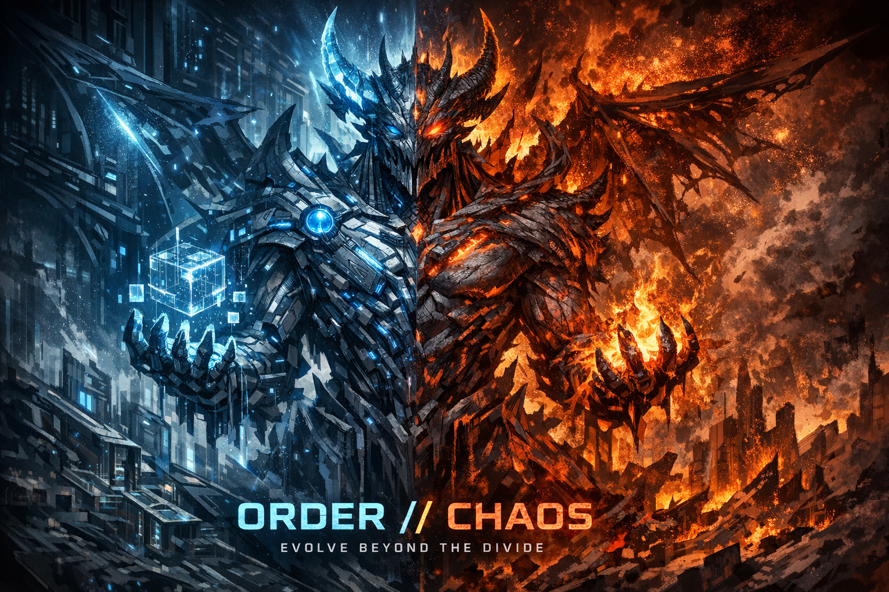
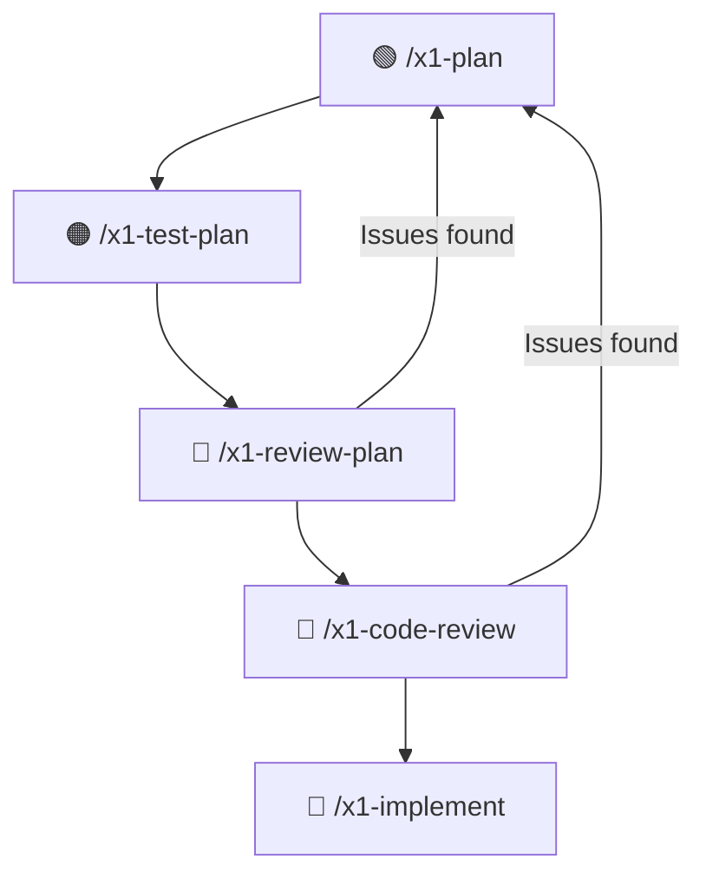

# X1 Method for Claude Code

  

## The industry is splitting in two. Pick your side.

Right now, a divide is forming in software engineering. On one side: developers vibe coding with AI, shipping fast, and quietly drowning in technical debt they'll spend months untangling. On the other: engineers who refuse to use AI at all, watching their competitors ship in weeks what takes them quarters.

**There's a third path.** The one where you use AI at full speed *and* the architecture holds. Where you deliver a month's roadmap in a week and the code survives its first production incident without a 2 AM page. Where your colleagues ask "how did you build that so fast?" and the answer isn't luck or cutting corners.

That's X1.

## Born from a 20,000-line disaster

X1 started when an AI coding tool generated a single service file that was **20,000 lines long**. It violated every architectural principle in the book: single responsibility, dependency inversion, separation of concerns, all of it. The file compiled. The tests passed. It looked like a productive day.

It was a ticking time bomb.

That's what vibe coding produces at scale. Code that looks right, compiles right, and collapses the moment production gets creative. Fast, confident, and architecturally catastrophic.

X1 was built to make sure that never happens again. Not by slowing down, but by **thinking before coding**. And it works.

## The proof

We've built and deployed **5 enterprise systems** using X1. Not prototypes. Not demos. Production systems handling real workloads:

- **Complete SaaS platforms** designed, built, and shipped in a couple of weeks
- **Enterprise services** delivered in days, not months
- Didn't like Microsoft's fees for semantic search? X1 + [Claude Code](https://claude.com/claude-code) built a replacement in a couple of days

One senior engineer. No team of 10. No six-month timeline. Just one architect who knows their domain, armed with X1 and Claude Code, delivering in a week what used to take over 30 weeks.

## Who this is for

X1 is for the engineer who designs the application end to end. The solutions architect. The senior full-stack developer. The technical lead who owns the entire journey from requirements to production.

You already know that architecture matters. You've seen what happens when teams skip it: services that can't scale, components that can't be tested, abstractions that make everything harder. You've spent your career building the judgement to avoid those traps.

X1 doesn't replace that judgement. It **amplifies it**. You make the decisions. You shape the architecture. You enforce the principles. AI handles the typing. The result is enterprise-grade software: SOLID, scalable, observable, resilient. Built at a speed that makes people wonder how you did it.

Every plan is verified against architectural requirements (AR-1 through AR-7) and non-functional requirements (NFR-1 through NFR-8) covering testability, observability, resilience, concurrency safety, and deterministic lifecycle management. This isn't "move fast and break things." This is **move fast and build things properly.**

## Before X1

There's a service in your codebase that nobody wants to touch. The tech lead who built it left, and the knowledge walked out the door with them. Business rules are entombed in the code. The documentation describes a system from two years ago. Tests exist, but nobody trusts them enough to refactor anything, so the service just grows. Every feature gets bolted on. Every bug fix is a prayer.

The previous developer was a vibe coder, and the damage is everywhere. "What architecture?" is the honest answer. Concrete dependencies. Business logic in controllers. Three different validation approaches, none of them complete. The codebase isn't designed. It accumulated.

When it's time to build something new, user stories take weeks to pin down. Requirements meetings go in circles. "What if we've forgotten something?" haunts every sprint planning session. And when you finally start coding, the acceptance criteria turn out to be ambiguous. You build what you *think* was meant, and half of it gets reworked after review.

Every engineer reading this has lived some version of this story.

## After X1

Monday morning. You type `/x1-plan` and describe the feature.

X1 pushes back immediately. It stress-tests your user stories with realistic and adversarial scenarios, because systems don't fail on the happy path. They fail at the edges. "What happens when two users do this simultaneously?" "What if this service is down when that event fires?" "What does 'handle errors gracefully' actually mean in production at 3 AM?" By the time user stories are locked, the ambiguities are gone and the edge cases are already captured. Every acceptance criterion is testable. Nothing has been forgotten, because X1 found the gaps before they became bugs.

Then it investigates your codebase. It finds the existing service you were about to duplicate. It identifies the patterns your team already uses and follows them. It proposes architecture that fits what's already there, not a greenfield fantasy that ignores two years of decisions.

You stress-test the design together. "What if 1,000 users hit this endpoint?" "What if the database is slow?" "What if someone calls this twice?" The architecture gets pressure-tested before a single line of code exists.

By lunch, you have a complete plan: user stories, architecture, code snippets verified against the real codebase, a numbered implementation checklist, and a full test plan with every test mapped to every acceptance criterion.

By end of day, it's implemented. Tests are green. Every test traces to an AC. Every AC traces to a user story. The whole thing is ready for CI/CD.

That used to be a two-week sprint. With X1, it's a Tuesday.

## What this means for your career

The AI revolution in coding isn't coming. It's here. And the market is about to get very clear about who can use it and who can't.

Companies don't want vibe coders who produce mountains of AI slop. They want engineers who can **leverage AI and maintain quality**. The person who can do the work of a team, with architecture that doesn't collapse under load, is the most valuable engineer in the building.

X1 makes you that person. When you walk into a planning meeting and say "I can have that built and tested by Friday," and then you actually do it, with clean architecture and full test coverage, people notice. Stakeholders notice. Your salary negotiation notices.

The gap between engineers who can use AI productively and those who can't is becoming the most important skill differential in the industry. X1 puts you on the right side of that gap.

## How it works

🟢 **Plan**: problem discovery, user stories, architecture, implementation checklist
🟠 **Test**: design tests that break things before code exists
🔴 **Review**: adversarial review of the plan, then its code snippets
🔵 **Implement**: mechanical TDD execution of what survived

> **Plan mode is required for steps 1-4.** Use `/plan` to enter plan mode before running `/x1-plan`. The entire planning, testing, and review workflow happens in plan mode. Claude researches, designs, and stress-tests without touching your code. Only `/x1-implement` (step 5) runs outside plan mode, where Claude executes against the approved plan.

The core idea is simple: **make all the decisions in the plan, where changes cost nothing. Then let AI execute mechanically against a plan that's already been stress-tested.** By the time code is written, most of the bugs are already dead.

### 1. Define the plan: `/x1-plan`

This is where most of the value lives. Instead of jumping to code, `/x1-plan` walks through a deliberate sequence that keeps you in the architect's seat:

**Start with the problem, not the solution.** What are you actually solving? Who's affected? What happens if you don't solve it? The skill pushes back on vague requirements and asks the questions you haven't thought of yet. It's a thinking partner, not a yes-machine.

**User stories focused on outcomes.** Not "as a user I want a feature." Acceptance criteria must describe testable end-to-end outcomes, not implementation details. This keeps the plan focused on *what* users need, not *how* the code works internally.

**Codebase investigation, only after requirements are locked.** The AI searches for existing implementations, understands your patterns, and reuses before creating. This is the single biggest waste eliminator. AI assistants love creating new things, and most of the time the thing already exists.

**Architecture with stress testing.** You shape the architecture. The AI stress-tests it with realistic scenarios before any code is written. What happens under concurrent load? What if a dependency is down? Where are the single points of failure? You develop these scenarios together, exposing weaknesses in the design while it's still just a document.

**Code snippets verified against the actual codebase.** Every method call, field name, and constructor is checked against reality. Not assumed, verified. Snippets are tagged `[VERIFIED]` or `[CONCEPTUAL]` so you know which are trustworthy.

**A traceable implementation checklist.** Every item numbered, every item traced to a user story and acceptance criterion. TDD-ordered: test first (expect red), code second (expect green). This becomes the contract that implementation executes against.

The plan is the artifact. If the plan is right, implementation is mechanical. If the plan is wrong, no amount of clever coding saves you.

### 2. Design tests that break things: `/x1-test-plan`

Before writing implementation code, design tests that try to destroy it. The X1 philosophy: you're not here to validate that code works. You're here to **prove it doesn't**.

- Break assumptions: what did the developer assume would never happen?
- Push boundaries: zero, negative, max values, null, empty, 10MB of garbage
- Race for races: force bad timing in concurrent operations
- Inject chaos: failures, randomness, delays at the worst possible moments

Every test traces back to an acceptance criterion. When you're done, you can prove that every requirement has been tested.

### 3. Review the plan adversarially: `/x1-review-plan`

Before a single line of code is written, the plan gets torn apart:

- Are code snippets using real method signatures or hallucinated ones?
- Does every acceptance criterion have a test? Does every test verify something meaningful?
- Are there error handling gaps? Missing edge cases? Silent failure paths?
- Does the architecture comply with project principles?
- Is there unnecessary code? Could this be simpler?

The reviewer's job is not to approve. It's to find every way the plan will fail. This is the Chaos Demon at work: adversarial by design.

### 4. Review plan code snippets: `/x1-code-review`

The plan's code snippets get a full code review before implementation. Security, architecture, performance, correctness, all checked against the actual codebase, not in isolation.

### 5. Implement mechanically: `/x1-implement`

By now, the plan has been stress-tested, the tests are designed, the code snippets are verified. Implementation follows the checklist item by item with completeness tracking. No creative decisions left; those were all made (and challenged) in the plan.

TDD order enforced: write the test first, watch it fail, write the code, watch it pass. Every item tracked. No silent skips. A blocking completion gate prevents declaring "done" with unresolved items.

At the end, full traceability lets you verify that every user story, every acceptance criterion, every test, and every implementation item is accounted for. Nothing slipped through.

### Why this order matters

Vibe coding is: code, then review, then test, then fix. Each stage discovers problems the previous stage created.

X1 is: plan, then attack the plan, then implement what survived. By the time code is written, most of the bugs have already been found and fixed in a document, where changing your mind costs nothing.

## Supporting Skills

| Skill | Purpose |
|-------|---------|
| `/x1-review-git` | Review uncommitted changes against X1 standards |
| `/x1-audit-plan` | Post-implementation gap analysis, verify 100% plan coverage |
| `/x1-review-tests` | Review existing tests or generate new ones |
| `/x1-architecture-review` | Deep architectural analysis with AR/NFR compliance |
| `/x1-problem-solve` | Structured problem diagnosis |
| `/x1-git-commit` | Commit with safety checks and proper messages |
| `/x1-git-hold` | Prevent accidental commits until you're ready |
| `/x1-handover` | Generate context for continuing in a new session |
| `/x1-time-analysis` | Estimate cost savings from using X1 (run after ~1 week of usage) |

## Get started

1. Clone this repository
2. Copy the `.md` files to your Claude Code skills directory:
   - **User-level**: `~/.claude/commands/` for global availability
   - **Project-level**: `.claude/commands/` in your project root
3. Open Claude Code, type `/plan` to enter plan mode, then `/x1-plan`
4. Describe what you want to build

That's it. Five minutes from clone to your first X1 plan. You'll never go back to vibe coding.

## Origins: The Chaos Demon

The adversarial review methodology within X1 is called the "Chaos Demon", inspired by [Chaos Engineering](https://en.wikipedia.org/wiki/Chaos_engineering). Netflix pioneered the concept with [Chaos Monkey](https://netflix.github.io/chaosmonkey/) in 2010: after a major database outage, they started deliberately killing production servers to force engineers to build resilient systems.

X1 applies the same adversarial mindset earlier, during planning and code review instead of in production. The insight: **it's cheaper to find bugs in a plan than in code, and cheaper in code than in production**.

| Stage | Relative Cost to Fix |
|-------|---------------------|
| Planning | 1x |
| Development | 6x |
| Testing | 15x |
| Production | 100x |

## Customization

These skills are designed for .NET and React/TypeScript but adapt to any stack:

1. Modify language-specific sections in the review skills
2. Adjust architecture layer references to match your patterns
3. Update conventions to match your project

## Requirements

- [Claude Code](https://claude.com/claude-code)

## License

[Creative Commons Attribution-NonCommercial 4.0 International (CC BY-NC 4.0)](https://creativecommons.org/licenses/by-nc/4.0/)

**Free for:** Personal projects, educational use, and non-commercial open source.

**Commercial use requires a license.** Contact us:
- **Email:** office@reqwiseconsulting.com
- **Website:** [www.reqwiseconsulting.com](https://www.reqwiseconsulting.com)

## Contributing

Contributions welcome. Ensure changes:
- Follow the X1 philosophy: adversarial, not optimistic
- Add concrete failure scenarios, not vague guidelines
- Include specific, actionable fixes for issues identified
